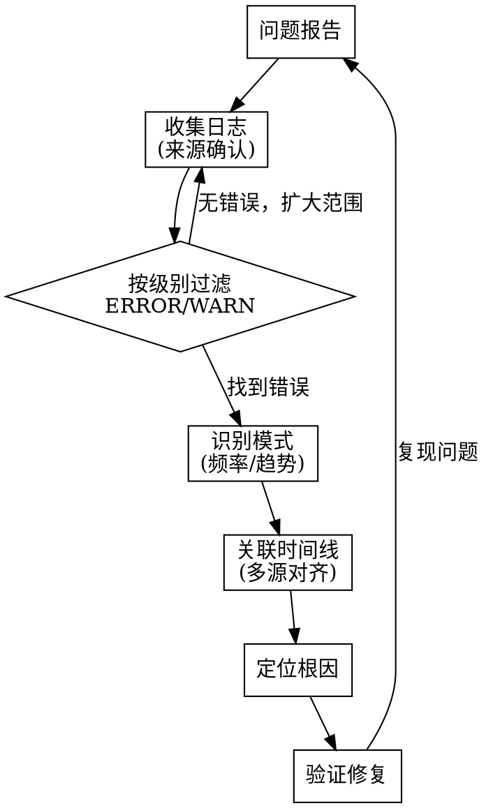

---

---


# 日志分析 Skill

## 概述

系统化日志分析方法，从日志中快速定位问题根因。

**核心原则**: 先看错误级别，再看上下文。日志不会说谎。

## 日志分析流程



## 日志收集

### Linux 系统

```bash
# 系统日志
journalctl --since "1 hour ago" --priority=err
journalctl -u <service> -f

# 内核日志
dmesg | tail -100
dmesg -T | grep -iE 'error|warn|fail|oom'

# 安全日志
tail -f /var/log/auth.log        # Debian/Ubuntu
tail -f /var/log/secure           # CentOS/RHEL

# 应用日志
tail -f /var/log/nginx/error.log
tail -f /var/log/mysql/error.log
```

### Docker 容器

```bash
# 容器日志
docker logs <container> --tail 200 --since "10m"
docker logs <container> 2>&1 | grep -iE 'error|exception|fatal'

# 实时跟踪
docker logs -f <container>

# 所有容器
docker ps -q | xargs -I {} docker logs --tail 50 {} 2>&1 | grep -i error
```

### Kubernetes

```bash
# Pod 日志
kubectl logs <pod> -n <ns> --tail=500
kubectl logs <pod> -n <ns> --previous    # 崩溃重启前的日志

# 多 Pod 日志
kubectl logs -l app=<label> -n <ns> --tail=100

# 按关键字搜索
kubectl logs <pod> -n <ns> | grep -iE 'error|exception|timeout|panic'

# 所有 Pod 搜索
kubectl get pods -n <ns> -o name | xargs -I {} kubectl logs {} -n <ns> --tail=100 2>&1 | grep -iE 'error|fatal'
```

### Nginx 日志分析

```bash
# 5xx 错误统计
awk '$9 >= 500' /var/log/nginx/access.log | awk '{print $9, $7}' | sort | uniq -c | sort -rn

# 慢请求 (>5s)
awk '$NF > 5000' /var/log/nginx/access.log

# Top IP 访问
awk '{print $1}' /var/log/nginx/access.log | sort | uniq -c | sort -rn | head -20

# Top URL 错误
awk '$9 >= 400 {print $9, $7}' /var/log/nginx/access.log | sort | uniq -c | sort -rn | head -20
```

### 数据库日志

```bash
# MySQL 慢查询
tail -f /var/log/mysql/mysql-slow.log
mysqldumpslow -s t /var/log/mysql/mysql-slow.log | head -20

# PostgreSQL 慢查询
grep "duration:" /var/log/postgresql/postgresql*.log | sort -t: -k2 -rn | head -20
```

## 分析技巧

### 时间线关联

```bash
# 多源日志按时间对齐（使用相同时间格式）
journalctl --since "14:00" --until "14:30" --output=short-iso
docker logs --since "2024-01-01T14:00:00" --until "2024-01-01T14:30:00" <container>
```

### 日志模式识别

| 模式 | 含义 | 操作 |
|------|------|------|
| 短时间内大量 ERROR | 突发故障/依赖不可用 | 检查上游服务 |
| 缓慢增长的错误 | 资源耗尽 | 检查磁盘/内存/连接数 |
| 周期性错误 | 定时任务/探针失败 | 检查 cron/probe 配置 |
| 单条 FATAL 后无日志 | 进程崩溃 | 检查 core dump/内存 |
| 大量 WARN 无 ERROR | 潜在问题，尚未触发 | 提前处理 |
| 错误 + 恢复 | 自愈成功 | 确认恢复逻辑正确 |

### 搜索模式

```bash
# 通用错误搜索
grep -iE 'error|exception|fatal|panic|timeout|refused|denied|kill' <logfile>

# 排除已知无害错误
grep -iE 'error|warn' <logfile> | grep -vE 'ignorable pattern|expected error'

# 统计错误频率
grep -c 'ERROR' <logfile>

# 错误按小时统计
grep 'ERROR' <logfile> | awk '{print $1, $2}' | cut -d: -f1-2 | sort | uniq -c
```

## 工具推荐

```bash
# lnav — 交互式日志查看器
lnav /var/log/syslog

# multitail — 多文件实时跟踪
multitail /var/log/syslog /var/log/auth.log

# grc — 彩色日志
grc tail -f /var/log/nginx/access.log

# jq — JSON 日志处理
cat app.log | jq 'select(.level == "error")' | jq '.message'
```

## Red Flags

| 想法 | 现实 |
|------|------|
| "日志太多了看不完" | 先按级别过滤，只看 ERROR/FATAL |
| "这个错误以前也有，应该没事" | 每次都要确认，习惯性问题可能正在恶化 |
| "没有错误就是没问题" | 检查 WARN 级别，性能下降往往先在 WARN 中出现 |
| "重启看看" | 重启前保存日志，否则丢失了现场 |
